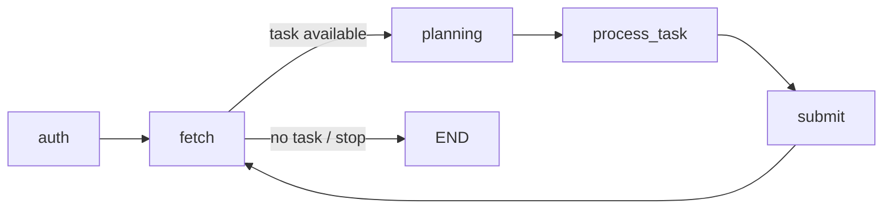
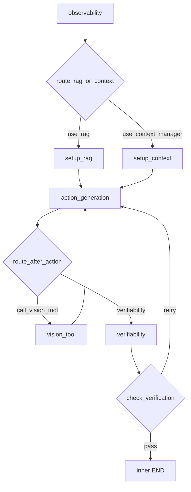

# ARCHITECTURE

## 1. Overview
The agent is implemented as a nested LangGraph workflow for competition execution.

- Outer loop manages session and task lifecycle.
- Inner loop solves one task with retrieval/tooling and verification.

Active task families:
- question-answering
- folder-organisation

Codebase layout:
- runtime package: `src/devday_agent/`
- tests: `src/tests/`

## 2. Runtime Graph

### 2.1 Outer loop (competition lifecycle)

Node intent:
- `auth`: create/refresh session and sync token to state.
- `fetch`: obtain next task and normalize `task_type` when missing.
- `planning`: generate concise planning hints from `prompt_template`.
- `process_task`: run the inner graph once for the current task.
- `submit`: submit result and clear task state on success.

### 2.2 Inner loop (per-task solving)

Important behavior:
- QA path can trigger vision analysis through `tool_calls`.
- Vision observations feed back into action generation (ReAct-like loop).
- Verification supports retry, max-attempt fallback, and grounding-based fallback.

## 3. State and Contracts

State models:
- outer: `devday_agent.agent.state.OuterState`
- inner: `devday_agent.agent.state.InnerState`

Structured output contracts:
- API payloads: `devday_agent.models.api_schemas`
- LLM schemas: `devday_agent.models.llm_schemas`

Result contract from inner to outer:
- `task_result.answers`
- `task_result.thought_log`
- `task_result.used_tools`

## 4. Core Components

- `devday_agent.agent.graph`: graph construction and wiring.
- `devday_agent.agent.nodes.outer_loop`: auth/fetch/planning/submit.
- `devday_agent.agent.nodes.inner_loop`: parsing, retrieval, action, verification.
- `devday_agent.agent.nodes.router`: branch and retry routing policy.
- `devday_agent.clients.competition_client`: resilient HTTP client for sessions/tasks/submissions.
- `devday_agent.clients.llm_client`: structured generation with retry and overflow handling.
- `devday_agent.tools.document_parser`: PDF parsing + image placeholder extraction + image OCR.
- `devday_agent.tools.rag_engine`: BM25 + FAISS hybrid retrieval with optional reranking.
- `devday_agent.tools.context_manager`: compressed context and per-file summary cache.
- `devday_agent.tools.vision_tool`: image cache inspection via OpenAI vision.
- `devday_agent.core.checkpoint`: session checkpoint and parsed/summary cache persistence.
- `devday_agent.core.logger`: console + rotating file logging.

## 5. Parsing and Retrieval Strategy

### 5.1 Document parsing
`document_parser` uses MIME/extension dispatch:
- PDF: per-page parse with `pymupdf4llm`, with image placeholders cached to disk.
- text-like files: UTF-8 decode fallback.
- image files (`png/jpg/jpeg/webp`): normalize then OCR with OpenAI vision.

### 5.2 Retrieval branch decision
`observability_node` sets `use_rag` (typically based on task type and resource volume).

### 5.3 Hybrid retrieval
`rag_engine` combines:
- lexical retrieval (BM25)
- semantic retrieval (FAISS + OpenAI embeddings)

Optional reranking is supported and guarded by config flags.
Reranking is enabled by default in current configuration.

## 6. Verification and Grounding

Verification is a first-class stage:
- scores confidence
- validates answer/task-format constraints
- enforces retry policy through router

For QA, grounding safeguards track evidence markers and can force conservative fallback when retries are exhausted.

Routing pass criteria:
- `is_verified == True` and `confidence_score >= VERIFIER_MIN_CONFIDENCE`
- or explicit grounding fallback
- or `attempts >= MAX_RETRIES`

## 7. Reliability and Failure Handling

- HTTP retry with exponential backoff for transient errors.
- 401 handling with session refresh.
- 409 terminal semantics handled in task fetch flow.
- LLM retry logic for validation/timeout/rate-limit/context-overflow conditions.
- prompt/context trimming on overflow retries.
- checkpoint persistence for session continuity and cache reuse.

## 8. Runtime Artifacts

Default storage root: `storage/`

Important files/directories:
- `storage/agent.log`
- `storage/session_checkpoint.json`
- `storage/image_cache/`
- `storage/parsed_cache/`

These artifacts are operational state and should not be versioned.
