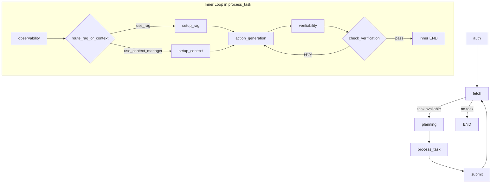

# ARCHITECTURE

## 🧭 System Workflow
The agent is built as a **nested LangGraph system**:
- Outer Loop: competition lifecycle (`auth -> fetch -> planning -> process_task -> submit`).
- Inner Loop: per-task solving with verification and retry.



ASCII fallback:

```text
OUTER: auth -> fetch -> planning -> process_task -> submit -> fetch ...
                      \-> end (when no task)

INNER (inside process_task):
observability -> (setup_rag | setup_context) -> action_generation -> verifiability
                                                          ^               |
                                                          |---- retry -----|
```

## 🧱 Directory Structure
- `core/`: logging, checkpoint persistence, and base exceptions.
- `clients/`: competition HTTP client and structured LLM client wrappers.
- `agent/nodes/`: node handlers for outer/inner loop execution.
- `agent/graph.py`: graph composition and conditional routing edges.
- `tools/`: document parser, context manager, and hybrid RAG retrieval.
- `models/`: typed schemas for API payloads and LLM structured output.
- `tests/`: unit tests for retry behavior, verification, parser tiers, and planning.
- `storage/`: runtime artifacts (session checkpoint, logs, caches, downloaded resources).

## 🧠 ADR-01: Parsing and OCR Strategy
### Decision
Use a two-path parser strategy:
1. **PDF path**: page-wise extraction with PyMuPDF/PyMuPDF4LLM and image placeholder caching.
2. **Image path**: OpenAI vision OCR after normalization.

### Why
- Most resources are PDFs and benefit from robust page-level parsing plus placeholders.
- Image resources require high-accuracy OCR and are handled directly by OpenAI vision.
- This removes local runtime dependency drift and keeps behavior consistent across environments.

### Where in code
- `tools/document_parser.py`

## 🔎 ADR-02: Hybrid RAG for QA
### Decision
For multi-document QA, retrieval uses **BM25 + FAISS vector search** via ensemble retrieval.

### Why
- BM25 handles exact lexical matches well.
- FAISS embeddings handle semantic matches.
- Hybrid retrieval improves evidence recall across noisy as-built document sets.

### Where in code
- `tools/rag_engine.py`
- Activated from `agent/nodes/inner_loop.py` (`setup_rag_node`).

## ♻️ ADR-03: Self-Correction via Verifiability Node
### Decision
Use a verification gate to enforce answer quality before submit:
- `verifiability_node` scores and validates draft output.
- `check_verification` routes `retry` back to `action_generation`.
- Loop stops when confidence threshold is met or retry limit reached.

### Why
- Adds resilience against first-pass hallucinations or weak confidence.
- Keeps output quality bounded by explicit policy.

### Where in code
- `agent/nodes/inner_loop.py`
- `agent/nodes/router.py`
- Config knobs: `VERIFIER_MIN_CONFIDENCE`, `MAX_RETRIES` in `config.py`

## 🔐 Reliability Notes
- API retries with backoff/jitter on retryable HTTP statuses.
- Token/session refresh logic on unauthorized responses.
- Context overflow handling trims message history and retries in LLM client.
- Submit failure keeps task state for retry in outer loop.
